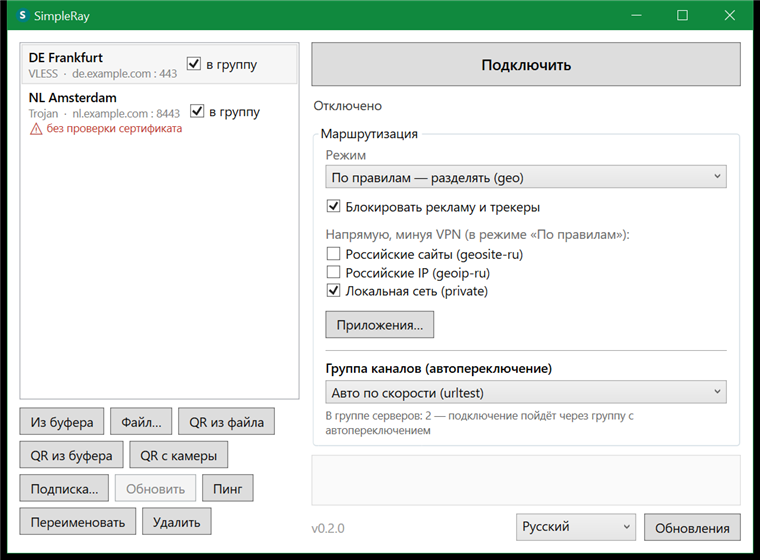

# SimpleRay

Простой VPN-клиент для Windows поверх [sing-box](https://github.com/SagerNet/sing-box):
импортируете ссылку на сервер (или подписку, или QR-код) — и весь трафик системы идёт
через зашифрованный туннель. Без ручной правки конфигов и без локального прокси-порта.



## Возможности

- **Протоколы:** VLESS, VMess, Trojan, Shadowsocks, WireGuard; TLS/REALITY, uTLS-отпечатки,
  транспорты ws / grpc / http.
- **Импорт профилей:** ссылки `vless://`/`vmess://`/`trojan://`/`ss://` из буфера или файла,
  WireGuard `.conf`, QR-код (из файла, из буфера, с веб-камеры), подписки по URL.
- **Маршрутизация:** глобально, по правилам (geo) или напрямую; обход VPN для российских
  сайтов и IP, локальной сети; блокировка рекламы и трекеров; правила по приложениям
  (какие процессы через VPN, какие мимо).
- **Выбор DNS-резолвера** с проверкой доступности прямо с вашей машины (DoH, плюс UDP для
  прямого трафика).
- **Группы каналов** с автопереключением по скорости (urltest) или ручным выбором (selector).
- **Удобства:** сворачивание в трей, автоподключение при запуске, 9 языков интерфейса,
  проверка и установка обновлений из GitHub Releases (с проверкой SHA256), шифрование
  профилей на диске (DPAPI).

## Требования

- Windows 10 версии 1809 (build 17763) или новее, x64.
- Права администратора нужны для поднятия TUN-адаптера — приложение запросит их само
  (UAC) в момент подключения.

## Установка

Скачайте с [Releases](https://github.com/OlBaskov-rec/SimpleRay/releases):

- **Портативную сборку** `SimpleRay-<версия>-win-x64.zip` — распакуйте и запустите
  `SimpleRay.exe`; либо
- **Установщик** `SimpleRay-<версия>-setup.exe` (ставится в профиль пользователя, без
  прав администратора).

> Сборки пока не подписаны, поэтому SmartScreen/антивирус могут предупредить при первом
> запуске.

## Сборка из исходников

Нужен .NET 8 SDK (для сборки) и PowerShell (для загрузки зависимостей).

```powershell
# 1. Подтянуть бандл-зависимости (sing-box.exe, wintun.dll, geo-правила) с проверкой хэшей
./scripts/fetch-deps.ps1

# 2. Собрать и прогнать тесты
dotnet build SimpleRay.sln
dotnet test SimpleRay.sln

# 3. (Опционально) собрать портативный пакет в dist/
./scripts/publish-portable.ps1
```

Подробности релиза — в [docs/RELEASING.md](docs/RELEASING.md).

## Как это работает

Приложение генерирует конфиг sing-box из ваших профилей и настроек маршрутизации и
запускает `sing-box.exe` отдельным процессом, который поднимает TUN-адаптер (через
`wintun`). Локального прокси-порта на `127.0.0.1` нет — трафик перехватывается на уровне
сетевого адаптера, что закрывает ряд утечек. Подробнее — в [docs/GUIDE.ru.md](docs/GUIDE.ru.md)
и [SECURITY.md](SECURITY.md).

## Лицензия

[GNU GPL v3](LICENSE). Сведения о сторонних компонентах (включая sing-box под GPL-3.0,
wintun и geo-данные) — в [THIRD-PARTY-NOTICES.md](THIRD-PARTY-NOTICES.md).
